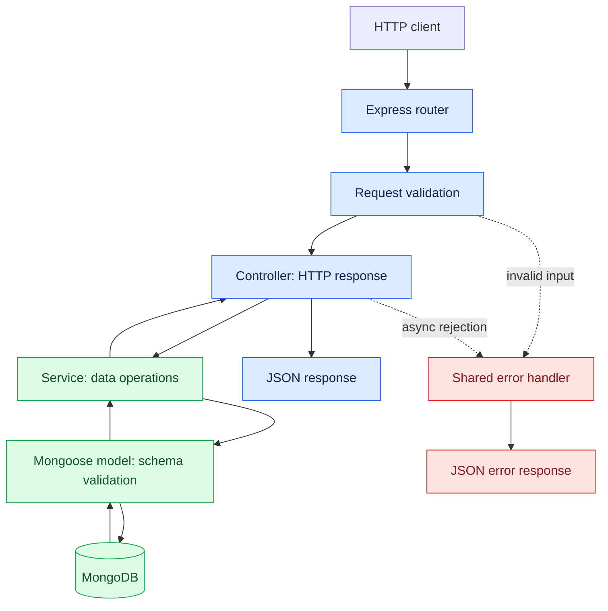
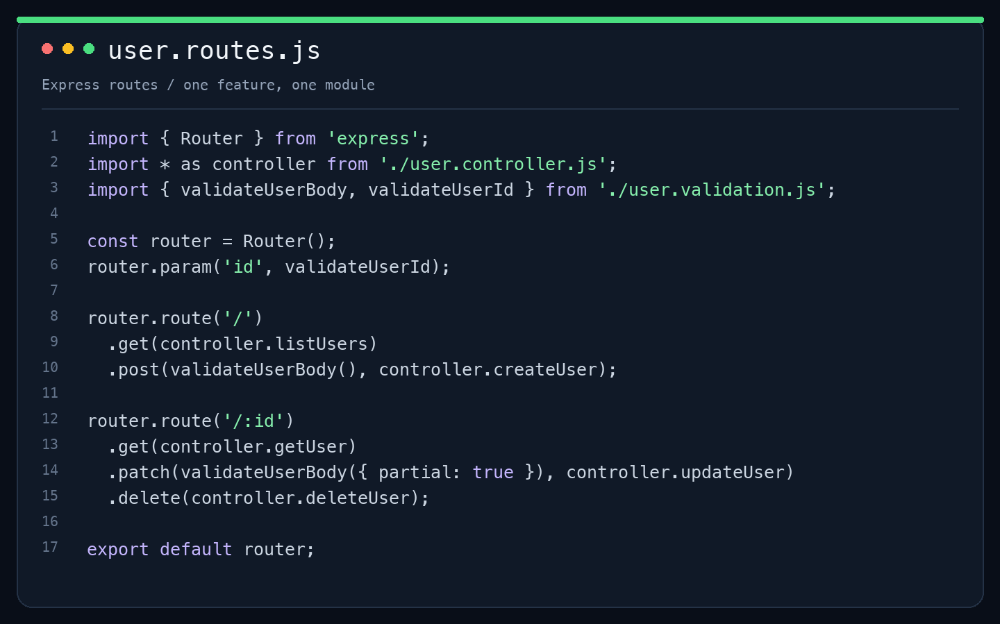
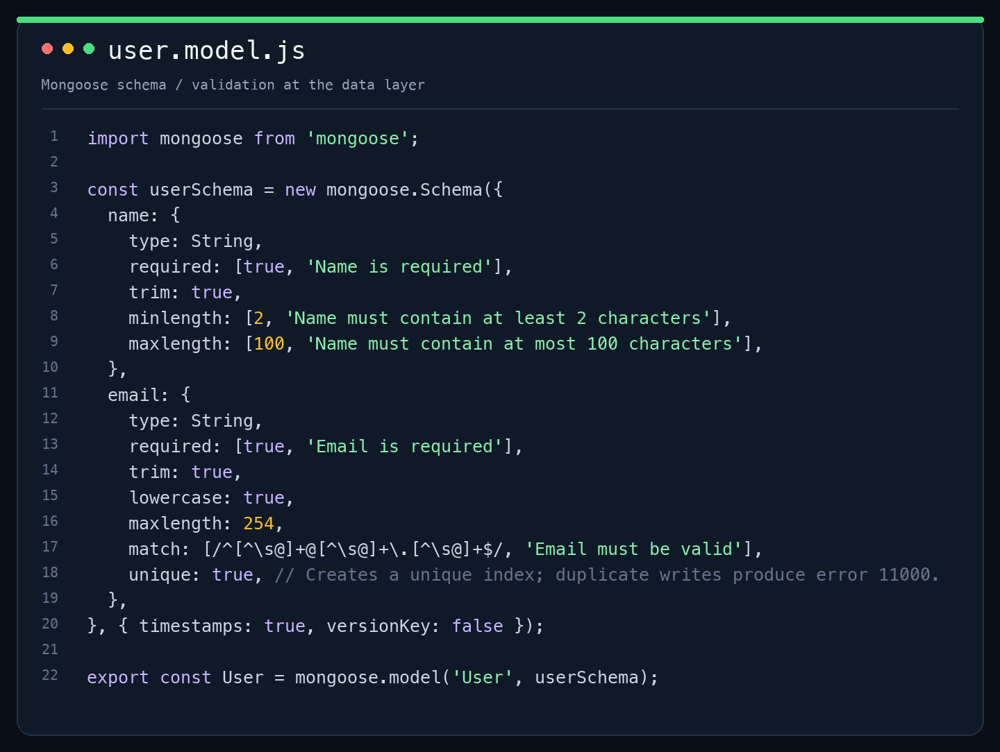

# 🌱 Mongo Sprout

**A modular Express + MongoDB boilerplate. Plant your next API here.**


[Quick start](#run-locally) · [Architecture](#architecture) · [Endpoints](#endpoints) · [Add a feature](#add-a-feature)

## What's included

- Feature modules with routes, controllers, services, models, and validation.
- Users CRUD example with pagination and a unique email index.
- Shared JSON error responses and guarded request bodies.
- MongoDB through Docker Compose or your own connection string.
- Health/readiness endpoints and graceful server shutdown.
- Seven automated HTTP/input/schema checks and GitHub Actions CI.

## Stack

JavaScript (ES modules), Express 5, MongoDB, and Mongoose 9. Requires Node.js 22.12+ and npm. Docker is optional if you already have MongoDB or an Atlas connection string.

Mongoose is an ODM (Object Document Mapper) for MongoDB.

## Structure

```text
mongo-sprout/
├── src/
│   ├── common/
│   │   ├── config/
│   │   │   ├── database.js
│   │   │   └── env.js
│   │   ├── middleware/
│   │   │   ├── errorHandler.js
│   │   │   └── notFound.js
│   │   └── utils/
│   │       └── AppError.js
│   ├── modules/
│   │   └── users/
│   │       ├── user.controller.js
│   │       ├── user.model.js
│   │       ├── user.routes.js
│   │       ├── user.service.js
│   │       └── user.validation.js
│   └── app.js
├── docs/images/              # README code previews
├── .github/workflows/ci.yml  # Node.js 22 / 24 checks
├── test/
│   └── app.test.js
├── .gitignore
├── docker-compose.yml
├── env.example
├── package-lock.json
├── package.json
├── README.md
└── server.js
```

`app.js` configures middleware and routes. `server.js` connects to MongoDB before accepting requests and closes connections on shutdown. `common` holds shared infrastructure. Each feature in `modules` owns its routes, controllers, services, schema, and request validation.

## Architecture



Routes choose the handler, controllers shape the response, services perform data operations, and models define stored documents. Express forwards rejected async handlers to the shared error middleware.

## Code previews

The images below show the actual routes and schema included in this repo. The editable source is linked below each preview.



[View route source](src/modules/users/user.routes.js)



[View model source](src/modules/users/user.model.js)

## Run locally

Clone the repository, then install and start it:

```sh
git clone https://github.com/real-VrajSoni/mongo-sprout.git
cd mongo-sprout
npm ci
cp env.example .env
docker compose up -d
npm run dev
```

The API runs at `http://localhost:3000`. Compose runs MongoDB only; run Node.js on your host. This local database has no authentication and is bound to localhost. For Atlas or another database, skip Docker and replace `MONGODB_URI` in `.env` with your connection string.

```sh
npm start          # run without file watching
npm test           # HTTP/input/schema checks; no database required
docker compose down  # stop MongoDB; preserve stored data
```

## Endpoints

| Method | URL | Purpose |
| --- | --- | --- |
| GET | `/health` | API liveness |
| GET | `/ready` | Database connection readiness |
| POST | `/api/v1/users` | Create user |
| GET | `/api/v1/users?page=1&limit=10` | List users (limit: 1–100) |
| GET | `/api/v1/users/:id` | Read user |
| PATCH | `/api/v1/users/:id` | Update name and/or email |
| DELETE | `/api/v1/users/:id` | Delete user (204, empty response) |

Create a user:

```sh
curl -i -X POST http://localhost:3000/api/v1/users \
  -H 'Content-Type: application/json' \
  -d '{"name":"Alex Doe","email":"alex@example.com"}'
```

Copy the `_id` from the response into `USER_ID`:

```sh
USER_ID='paste-the-user-id-here'
curl 'http://localhost:3000/api/v1/users?page=1&limit=10'
curl "http://localhost:3000/api/v1/users/$USER_ID"
curl -X PATCH "http://localhost:3000/api/v1/users/$USER_ID" \
  -H 'Content-Type: application/json' \
  -d '{"name":"Alex Smith"}'
curl -i -X DELETE "http://localhost:3000/api/v1/users/$USER_ID"
```

Success responses use `{ "success": true, "data": ... }`. Errors use `{ "success": false, "message": "..." }`. Invalid input returns 400; missing resources return 404; duplicate emails return 409. Names and emails are trimmed, and emails are lowercased. Creating a user requires both fields; PATCH requires at least one. Other fields and MongoDB update operators are rejected.

## Checks

```sh
npm test
```

The tests cover health/readiness responses, missing routes, malformed IDs and JSON, rejected fields, update-operator injection, pagination limits, and Mongoose normalization/validation. They do not require a database or cover persisted CRUD. GitHub Actions runs them on Node.js 22 and 24.

## Add a feature

Create another folder under `src/modules`, define its model/service/controller/routes, and mount the router in `src/app.js`. Shared middleware belongs under `src/common`.

This starter includes no authentication: all users endpoints are public. Add your application's authentication and authorization before using it for private data. Add CORS middleware with an explicit allowed frontend origin when a browser client runs on a different origin.

Express 5 forwards errors from async route handlers to the error middleware, so controllers need no async wrapper. Mongoose update validation is enabled explicitly with `runValidators: true`.

References: [Express error handling](https://expressjs.com/en/5x/guide/error-handling/), [Mongoose validation](https://mongoosejs.com/docs/validation.html).
