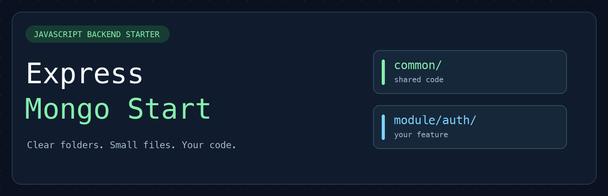
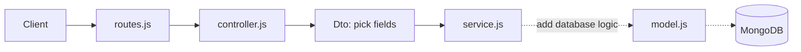

<p align="center">
  
</p>

<h1 align="center">Express Mongo Start</h1>

<p align="center">
  A beginner-friendly JavaScript backend starter.<br />
  Clear folders. Small files. Room for your own code.
</p>

<p align="center">
  
  
  
  <a href="LICENSE"></a>
</p>

<p align="center">
  <a href="#quick-start">Quick start</a> ·
  <a href="#project-structure">Project structure</a> ·
  <a href="#how-the-files-connect">How it works</a> ·
  <a href="#make-it-your-project">Make it yours</a> ·
  <a href="CONTRIBUTING.md">Contribute</a>
</p>

## A starting point you can understand

Use this repo when you want an Express and MongoDB project with a clear place for each file. It includes the server setup, database connection, shared error handling, and an auth module you can build on.

**Auth is a starter scaffold.** Register, login, forgot-password, logout, and reset-password routes return **501 Not Implemented** until you add their logic. This repo does not create users, authenticate requests, or send password-reset emails yet.

- **Simple setup:** four dependencies — Express, Mongoose, dotenv, and CORS.
- **Shared code:** database settings, DTOs, middleware, and helpers go in `common`.
- **Feature code:** each feature gets its own folder in `module`.
- **Easy to reuse:** use the template, change the database name, and start coding.

## Quick start

You need **Node.js 22.12 or newer** and a MongoDB database, running locally or on MongoDB Atlas.

### 1. Get the starter

Click **[Use this template](https://github.com/real-VrajSoni/express-mongo-start/generate)** to create your own repo, or clone this one:

```sh
git clone https://github.com/real-VrajSoni/express-mongo-start.git
cd express-mongo-start
npm install
```

### 2. Add your database settings

```sh
cp .env.example .env
```

On Windows, copy `.env.example` and rename the copy to `.env` in your file explorer.

```env
PORT=3000
MONGODB_URI=mongodb://127.0.0.1:27017/my_project
```

The example uses a local MongoDB server, which must be running. For Atlas, replace `MONGODB_URI` with your Atlas connection string, including your database name. Keep `.env` private; Git ignores it.

### 3. Run it

```sh
npm run dev
```

Open **http://localhost:3000** to see `Welcome to your API!`. JavaScript changes restart the server automatically. Use `npm start` to run without watching files. Restart the server after changing `.env`.

## Project structure

```text
src/
├── common/
│   ├── config/
│   │   └── db.js
│   ├── dto/
│   │   └── README.md
│   ├── middleware/
│   │   └── errorHandler.js
│   └── utils/
│       └── README.md
├── module/
│   └── auth/
│       ├── Dto/
│       │   ├── register.dto.js
│       │   ├── login.dto.js
│       │   ├── forgot-password.dto.js
│       │   ├── logout.dto.js
│       │   └── reset-password.dto.js
│       ├── controller.js
│       ├── middleware.js
│       ├── routes.js
│       ├── model.js
│       └── service.js
└── app.js
```

`server.js` is in the project root. It reads `.env`, connects to MongoDB, and starts Express. The small README files preserve the shared folders on GitHub and explain what belongs there.

| Location | What belongs here |
| --- | --- |
| `common/config` | Settings shared by the app, such as the database connection. |
| `common/dto` | DTOs used by more than one feature. |
| `common/middleware` | Shared request and error handlers. |
| `common/utils` | Small helper functions used in different places. |
| `auth/Dto` | Functions that pick the input fields for each auth action. |
| `auth/routes.js` | URLs and the controller functions they call. |
| `auth/controller.js` | Read the request and send the response. |
| `auth/service.js` | Add the steps that perform each action. |
| `auth/model.js` | Describe the user data stored in MongoDB. |
| `auth/middleware.js` | A place for auth-specific checks when you implement login. |

**DTO** means **Data Transfer Object**. Here, a DTO is just a small function that picks fields from a request body. The DTOs do not validate input or check passwords; add those checks when you implement the service.

## How the files connect



For `/api/auth/register`, the route calls the controller. The controller picks `name`, `email`, and `password` using the register DTO, then passes them to the service. The service currently throws a 501 error with a message telling you where to add your code.


[Read the DTO](src/module/auth/Dto/register.dto.js) · [Read the controller](src/module/auth/controller.js) · [Read the service](src/module/auth/service.js)

## Try a route

| Method | Route | Current behavior |
| --- | --- | --- |
| GET | `/` | Welcome message |
| POST | `/api/auth/register` | 501 placeholder |
| POST | `/api/auth/login` | 501 placeholder |
| POST | `/api/auth/forgot-password` | 501 placeholder |
| POST | `/api/auth/logout` | 501 placeholder |
| POST | `/api/auth/reset-password` | 501 placeholder |

```sh
curl -i -X POST http://localhost:3000/api/auth/register \
  -H 'Content-Type: application/json' \
  -d '{"name":"Alex","email":"alex@example.com","password":"example-password"}'
```

The response is deliberately clear:

```json
{
  "message": "Register is a starter placeholder. Add your code in service.js."
}
```

## Make it your project

1. Change the database name in `.env` for your project.
2. Start with one action in `auth/service.js`, or create a new feature such as `module/notes`.
3. Add model fields and DTO fields as your feature needs them.
4. Connect new routes in `app.js` with `app.use()`.

Add code only as your project needs it. When implementing auth, hash passwords, validate input, and add real session checks. `passwordHash` is a field for a hash; the starter does not hash passwords for you. `middleware.js` is a reserved file, not an access check.

## Contributing

New to open source? Small improvements are welcome: clearer comments, corrected docs, or focused fixes that make the starter easier to learn.

See **[CONTRIBUTING.md](CONTRIBUTING.md)** for a short guide. You can also **[open an issue](https://github.com/real-VrajSoni/express-mongo-start/issues/new)** with a question or suggestion.

## License

[MIT](LICENSE) — you can use and adapt this starter for your own projects. Keep the license notice when you redistribute it.
