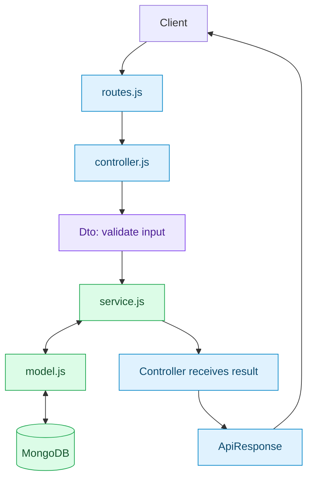
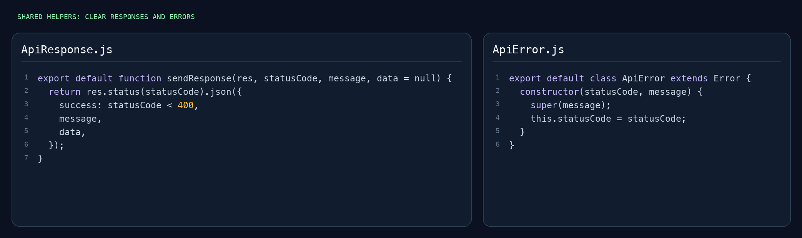

<p align="center">
  
</p>

<h1 align="center">Express Mongo Start</h1>

<p align="center">
  Your first backend, with a head start.<br />
  JavaScript · Express · MongoDB · Working authentication
</p>

<p align="center">
  
  
  
  <a href="LICENSE"></a>
</p>

<p align="center">
  <a href="#quick-start">Get started</a> ·
  <a href="#try-the-api">Try the API</a> ·
  <a href="#project-structure">Explore the files</a> ·
  <a href="#how-a-request-works">See the flow</a> ·
  <a href="CONTRIBUTING.md">Contribute</a>
</p>

## A small starter you can build on

Copy the project, start MongoDB, and begin adding your own features. The auth module already works: create an account, log in, view your account, log out, and reset your password locally.

- **Clear folders:** shared code in `common`, feature code in `module`.
- **Useful basics:** input validation, consistent API responses, shared error handling, and a request limit for auth routes.
- **Real MongoDB:** Mongoose models and a local database command, with no Docker setup required.
- **Working examples:** terminal requests and integration tests you can learn from.

This is a **localhost learning starter**. Password-reset delivery uses the server terminal during development. Connect an email provider before using that flow in a deployed app.

## Quick start

You need **Node.js 22.12 or newer** and npm. The first database or test run downloads the MongoDB binary once, so it needs an internet connection.

### 1. Copy the starter

Click **[Use this template](https://github.com/real-VrajSoni/express-mongo-start/generate)** for your own repository, or clone this one:

```sh
git clone https://github.com/real-VrajSoni/express-mongo-start.git
cd express-mongo-start
npm install
cp .env.example .env
```

On Windows, copy `.env.example` to `.env` in your file explorer if `cp` is unavailable.

The default settings are ready for local development:

```env
NODE_ENV=development
PORT=3000
MONGODB_URI=mongodb://127.0.0.1:27017/express_mongo_start
CLIENT_ORIGIN=http://localhost:5173
```

### 2. Start MongoDB — terminal 1

```sh
npm run db
```

Keep this terminal open. This starts a real MongoDB 8.2.6 process on port `27017`. Your data stays in `.mongo-data` between runs; Git ignores that folder.

**Already using MongoDB or Atlas?** Set `MONGODB_URI` in `.env` to your connection string and skip `npm run db`. If MongoDB is already running on port `27017`, use that instance.

### 3. Start the API — terminal 2

Open another terminal in the same project folder:

```sh
npm run dev
```

Visit **[http://localhost:3000](http://localhost:3000)**. You should see a JSON response with `"message": "Welcome to your API!"`.

Code changes restart the API automatically. Restart it after changing `.env`. Set `CLIENT_ORIGIN` to your frontend's address when you connect one, and keep `.env` private.

| Command | What it does |
| --- | --- |
| `npm run db` | Start the local MongoDB process. |
| `npm run dev` | Start the API and watch for code changes. |
| `npm start` | Start the API without watching files. |
| `npm test` | Run integration tests with a separate temporary database. |

## Try the API

Run these examples in a third terminal while the database and API are running. The example passwords are only for learning.

| Method | Route | What it does | Needs a token? |
| --- | --- | --- | --- |
| GET | `/` | Check the API is running. | No |
| POST | `/api/auth/register` | Create an account and session. | No |
| POST | `/api/auth/login` | Log in and start a new session. | No |
| GET | `/api/auth/me` | Read your account. | Yes |
| POST | `/api/auth/logout` | End your current session. | Yes |
| POST | `/api/auth/forgot-password` | Create a local password-reset token. | No |
| POST | `/api/auth/reset-password` | Set a new password using the reset token. | No |

### Create an account

```sh
curl -X POST http://localhost:3000/api/auth/register \
  -H 'Content-Type: application/json' \
  -d '{"name":"Alex","email":"alex@example.com","password":"Learn1234!"}'
```

### Log in

```sh
curl -X POST http://localhost:3000/api/auth/login \
  -H 'Content-Type: application/json' \
  -d '{"email":"alex@example.com","password":"Learn1234!"}'
```

Register and login return `data.user` with `id`, `name`, and `email`, plus `data.token` and `data.expiresAt`. Copy the token from your **latest login response** into the variable below:

```sh
TOKEN='paste_your_login_token_here'

curl http://localhost:3000/api/auth/me \
  -H "Authorization: Bearer $TOKEN"
```

Sessions last **24 hours**. Each user has one active session; a new login replaces the previous token.

### Log out

```sh
curl -X POST http://localhost:3000/api/auth/logout \
  -H "Authorization: Bearer $TOKEN"
```

The token stops working after logout. Log in again to get a new one.

### Reset a password locally

Request a reset token:

```sh
curl -X POST http://localhost:3000/api/auth/forgot-password \
  -H 'Content-Type: application/json' \
  -d '{"email":"alex@example.com"}'
```

Look in the **API server terminal** for `Reset token for alex@example.com: ...`. The token is never included in the HTTP response. Copy it into `RESET_TOKEN`:

```sh
RESET_TOKEN='paste_your_reset_token_here'

curl -X POST http://localhost:3000/api/auth/reset-password \
  -H 'Content-Type: application/json' \
  -d "{\"token\":\"$RESET_TOKEN\",\"password\":\"NewPassword123\"}"
```

Reset tokens expire after **15 minutes**, work once, and are replaced by a new reset request. A successful password reset also ends the current session. Log in again with the new password.

For privacy, forgot-password returns the same message whether an account exists. Terminal delivery is available in development and tests. With `NODE_ENV=production`, forgot-password returns `503` until you replace the local delivery flow with your own email integration.

## One response format

Every API response uses the same three fields:

```json
{
  "success": true,
  "message": "Your account",
  "data": {
    "user": {
      "id": "example-user-id",
      "name": "Alex",
      "email": "alex@example.com"
    }
  }
}
```

Errors set `success` to `false` and `data` to `null`. Invalid input returns `400`, missing or expired login returns `401`, duplicate email returns `409`, and unknown routes return `404`.

## Project structure

```text
src/
├── common/
│   ├── config/
│   │   ├── db.js                  # Connect Mongoose to MongoDB
│   │   ├── env.js                 # Read environment settings
│   │   └── localMongo.js          # Start MongoDB for local development
│   ├── dto/
│   │   ├── user.dto.js            # Public user fields
│   │   └── validation.js          # Shared input checks
│   ├── middleware/
│   │   ├── authLimiter.js         # Limit repeated auth requests
│   │   ├── errorHandler.js        # Turn errors into JSON responses
│   │   └── notFound.js            # Handle unknown URLs
│   └── utils/
│       ├── ApiError.js            # Error with an HTTP status
│       ├── ApiResponse.js         # Shared sendResponse function
│       ├── password.js            # Hash and compare passwords
│       ├── sendResetToken.js      # Print local reset tokens
│       └── token.js               # Create and hash tokens
├── module/
│   └── auth/
│       ├── Dto/
│       │   ├── register.dto.js
│       │   ├── login.dto.js
│       │   ├── forgot-password.dto.js
│       │   ├── logout.dto.js
│       │   └── reset-password.dto.js
│       ├── controller.js
│       ├── middleware.js
│       ├── routes.js
│       ├── model.js
│       └── service.js
└── app.js

test/auth.test.js
.env.example
server.js
package.json
```

| File | Its job |
| --- | --- |
| `server.js` | Connect to MongoDB, then start the server. |
| `app.js` | Set up Express and connect the routes. |
| `auth/routes.js` | Match URLs to controllers. |
| `auth/controller.js` | Read input, call the service, and send a response. |
| `auth/Dto/*.js` | Pick and check request fields; logout uses the verified user and token. |
| `auth/service.js` | Perform account, session, and password-reset actions. |
| `auth/model.js` | Describe the user data stored in MongoDB. |
| `auth/middleware.js` | Check the bearer token before protected routes. |

**DTO** means **Data Transfer Object**. Here, it is a small function that prepares the data the service needs. Shared validation checks names, emails, passwords, and reset tokens.

## How a request works

Registration follows this flow:



The controller uses `registerDto` to validate the input, then calls the service. The service hashes the password, creates the user, and starts a session. The controller sends the result using the shared response helper. Errors go to `errorHandler.js`. Protected routes such as `/me` first pass through `auth/middleware.js` to check the bearer token.


[Read the DTO](src/module/auth/Dto/register.dto.js) · [Read the controller](src/module/auth/controller.js) · [Read the service](src/module/auth/service.js)

### Two helpers worth knowing

Use `sendResponse` from [`ApiResponse.js`](src/common/utils/ApiResponse.js) to send JSON consistently:

```js
return sendResponse(res, 200, 'Notes loaded', { notes });
```

Throw [`ApiError`](src/common/utils/ApiError.js) when a request should fail with a specific status:

```js
throw new ApiError(404, 'Note not found');
```



[Read ApiResponse.js](src/common/utils/ApiResponse.js) · [Read ApiError.js](src/common/utils/ApiError.js)

Passwords use **bcrypt**. Session and reset tokens are random strings; MongoDB stores their **SHA-256 hashes**. These bearer tokens are ordinary server-checked tokens, not JWTs. Public user responses exclude passwords and stored token hashes.

## Make it your project

1. Change the database name in `.env` so your project has its own data.
2. Add a feature folder such as `src/module/notes`.
3. Create its model, routes, controller, service, and DTOs as needed.
4. Connect the new routes in `app.js` using `app.use()`.
5. Reuse `sendResponse`, `ApiError`, and `requireAuth` where they help.

Start with one feature and add only what your project needs.

## Run the tests

```sh
npm test
```

Seven integration tests make HTTP requests to the API and use a real temporary MongoDB database. They cover registration, login, logout, validation, private fields, expired sessions, and password-reset expiry and reuse. They do not change the database in your `.env`, and you do not need `npm run db` running for tests.

## Contributing

New to open source? Clearer explanations, focused fixes, and beginner-friendly examples are welcome. Read **[CONTRIBUTING.md](CONTRIBUTING.md)** or **[open an issue](https://github.com/real-VrajSoni/express-mongo-start/issues/new)** with an idea.

## License

[MIT](LICENSE) — use and adapt this starter for your own projects. Keep the license notice when redistributing it.
