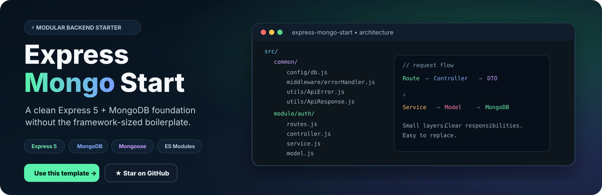

<p align="center">
  
</p>

<p align="center">
  <a href="https://github.com/real-VrajSoni/express-mongo-start/generate"><strong>⚡ Use this template</strong></a>
  ·
  <a href="https://github.com/real-VrajSoni/express-mongo-start"><strong>⭐ Star on GitHub</strong></a>
  ·
  <a href="https://github.com/real-VrajSoni/express-mongo-start/issues"><strong>💬 Ask a question</strong></a>
</p>

<p align="center">
  
  
  
  
  
  
</p>

---

# Build the API. Skip the boilerplate.

**Express Mongo Start** is a small, opinionated starting point for JavaScript backends using **Express 5 + MongoDB**.

It gives you a clear place for each responsibility:

`route → controller → DTO → service → model → database`

No giant framework. No mysterious folder dump. No pretend-to-be-production authentication.

Just a backend foundation you can understand and make your own.

## Why this exists

Starting an API from an empty folder is rarely the interesting part.

You still need to decide:

- where database configuration belongs
- where shared middleware lives
- how routes connect to controllers
- where business logic should go
- where MongoDB models belong
- how successful and failed responses should look

This starter makes those decisions once, so your next project can start with the part that actually matters: **building the product.**

## What you get

| | Included |
| --- | --- |
| 🧩 | Feature-oriented `src/module/` structure |
| 🧱 | Shared `src/common/` layer |
| 🍃 | MongoDB connection with Mongoose |
| 🛣️ | Express route → controller flow |
| 📦 | Lightweight DTO pattern for request input |
| ✅ | Consistent `success / message / data` responses |
| 🧯 | Shared HTTP error handling |
| 🔐 | Authentication scaffold ready to implement |
| ⚡ | Node's native watch mode for development |

## Architecture

<p align="center">
  
</p>

The important idea is **separation of responsibility**, not adding layers for the sake of it.

A request enters through a route, the controller coordinates it, a DTO picks the input fields, the service owns the work, and the Mongoose model handles database interaction.

## Project structure

```text
express-mongo-start/
├── src/
│   ├── common/
│   │   ├── config/
│   │   │   └── db.js
│   │   ├── dto/
│   │   ├── middleware/
│   │   │   └── errorHandler.js
│   │   └── utils/
│   │       ├── ApiError.js
│   │       └── ApiResponse.js
│   │
│   ├── module/
│   │   └── auth/
│   │       ├── Dto/
│   │       │   ├── register.dto.js
│   │       │   ├── login.dto.js
│   │       │   ├── forgot-password.dto.js
│   │       │   ├── logout.dto.js
│   │       │   └── reset-password.dto.js
│   │       ├── controller.js
│   │       ├── middleware.js
│   │       ├── model.js
│   │       ├── routes.js
│   │       └── service.js
│   │
│   └── app.js
│
├── docs/
├── .env.example
├── server.js
├── package.json
└── LICENSE
```

### The mental model

```text
common/
└── things many features can reuse

module/
└── auth/
    └── things that belong to authentication
```

That keeps feature code together while preventing shared helpers from being copied into every module.

## Quick start

### 1. Clone

```bash
git clone https://github.com/real-VrajSoni/express-mongo-start.git
cd express-mongo-start
npm install
```

Or create your own repository directly:

**[⚡ Use this template](https://github.com/real-VrajSoni/express-mongo-start/generate)**

### 2. Configure your environment

```bash
cp .env.example .env
```

Then add your MongoDB connection:

```env
PORT=3000
MONGODB_URI=mongodb://127.0.0.1:27017/my_project
```

A MongoDB local instance or Atlas connection works.

### 3. Start developing

```bash
npm run dev
```

The server starts after the MongoDB connection succeeds.

Open **http://localhost:3000**.

You should see:

```json
{
  "success": true,
  "message": "Welcome to your API!",
  "data": null
}
```

For a normal start without file watching:

```bash
npm start
```

## API

### Available now

| Method | Endpoint | Behavior |
| --- | --- | --- |
| `GET` | `/` | Returns the welcome response |
| `POST` | `/api/auth/register` | Auth scaffold → 501 |
| `POST` | `/api/auth/login` | Auth scaffold → 501 |
| `POST` | `/api/auth/forgot-password` | Auth scaffold → 501 |
| `POST` | `/api/auth/logout` | Auth scaffold → 501 |
| `POST` | `/api/auth/reset-password` | Auth scaffold → 501 |

### Example request

```bash
curl -i -X POST http://localhost:3000/api/auth/register \
  -H "Content-Type: application/json" \
  -d '{"name":"Alex","email":"alex@example.com","password":"example-password"}'
```

The route is wired. The service intentionally stops with `501 Not Implemented` until you implement the authentication logic.

That is a feature, not a bug: **the template never pretends unfinished security code is complete.**

## Consistent responses

The starter gives you one small helper instead of repeating response formatting everywhere.

**`src/common/utils/ApiResponse.js`**

```js
return sendResponse(res, 200, 'Notes loaded', { notes });
```

Response:

```json
{
  "success": true,
  "message": "Notes loaded",
  "data": {
    "notes": []
  }
}
```

For HTTP errors:

**`src/common/utils/ApiError.js`**

```js
throw new ApiError(404, 'Note not found');
```

The shared error handler turns that into the API response.

## Adding your first feature

The easiest way to extend the starter is to create another module.

For example:

```text
src/module/notes/
├── Dto/
├── controller.js
├── model.js
├── routes.js
└── service.js
```

Then mount the routes in `src/app.js`.

The starter stays useful because you can add features without having to redesign the whole backend around them.

## Authentication: intentionally unfinished

The `auth` module is a **structure to build on**, not a production-ready identity system.

The repository currently does **not** implement:

- password hashing
- sessions or token creation
- request validation
- authorization checks
- reset-password email delivery
- persisted authentication flows

The model contains `passwordHash` specifically so that, when you implement auth, you store a hash rather than a plaintext password.

## Built with

| Technology | Role |
| --- | --- |
| **Node.js 22.12+** | Runtime |
| **Express 5** | HTTP server and routing |
| **MongoDB** | Database |
| **Mongoose 9** | MongoDB ODM |
| **dotenv** | Environment variables |
| **CORS** | Cross-origin requests |
| **ES Modules** | JavaScript modules |

## Who is this for?

**→ Developers starting a new Express API**  
Get a sensible structure without spending an afternoon creating folders.

**→ Beginners learning backend architecture**  
The layers are explicit and small enough to trace from a request to the database.

**→ SaaS / MVP builders**  
Start from a foundation and spend your time on the feature that makes your product different.

**→ Anyone tired of over-engineered starters**  
There is no 200-file architecture hiding behind a “simple starter” label.

## Contributing

Good contributions make this starter **clearer, not heavier**.

Documentation improvements, focused fixes, and changes that keep the structure approachable are welcome.

Read [CONTRIBUTING.md](CONTRIBUTING.md) before opening a pull request.

## License

MIT © [Vraj Soni](https://github.com/real-VrajSoni)

---

<p align="center">
  <strong>Built to help you start building.</strong>
  <br />
  <sub>Found it useful? A ⭐ helps more developers discover it.</sub>
  <br /><br />
  <a href="https://github.com/real-VrajSoni/express-mongo-start">
    
  </a>
</p>
