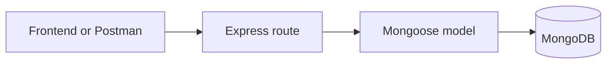
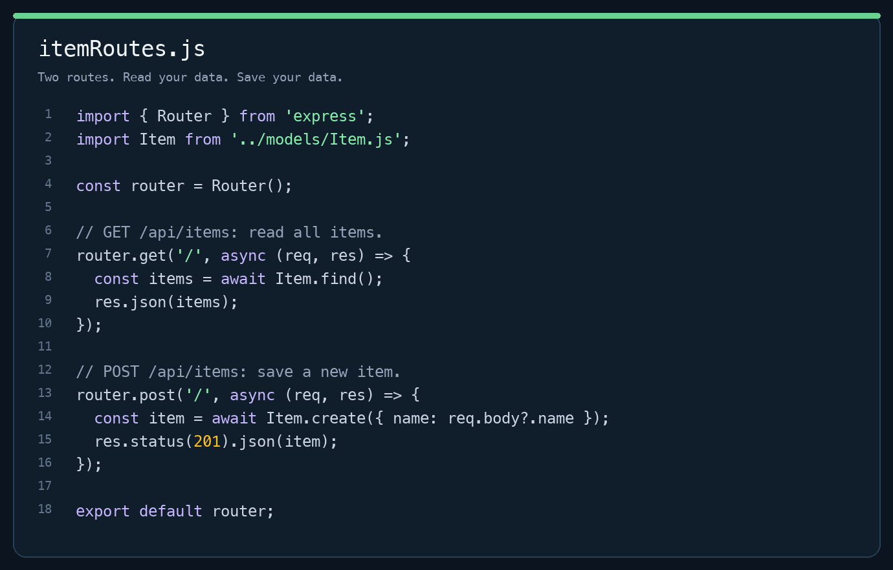

# Express Mongo Start

A small JavaScript backend starter for beginners learning fullstack web development. Copy it, connect MongoDB, and start building your project.

It uses **Express** for API routes, **Mongoose** to work with MongoDB, **dotenv** for settings, and **CORS** so your frontend can call the API.

## Start here

You need Node.js **22.12 or newer** and a MongoDB database. You can use MongoDB installed on your computer or a MongoDB Atlas database.

Click **Use this template → Create a new repository** on GitHub, download the ZIP, or clone this repo:

```sh
git clone https://github.com/real-VrajSoni/express-mongo-start.git
cd express-mongo-start
npm install
cp .env.example .env
```

On Windows, you can copy `.env.example` and rename the copy to `.env` using your file explorer.

Open `.env` and add your MongoDB connection string:

```env
PORT=3000
MONGODB_URI=mongodb://127.0.0.1:27017/my_project
```

The example above uses a local MongoDB server, which must be running. For Atlas, replace `MONGODB_URI` with your Atlas connection string, including the database name. Keep your `.env` file private; it is excluded from Git.

Start the server:

```sh
npm run dev
```

Open **http://localhost:3000**. You should see `Welcome to your API!`. The server restarts when you save a JavaScript file. Use `npm start` to run it without watching files.

## Where things go

```text
express-mongo-start/
├── src/
│   ├── config/
│   │   └── db.js          # Connect to MongoDB
│   ├── models/
│   │   └── Item.js        # Describe your data
│   ├── routes/
│   │   └── itemRoutes.js  # Read and save data
│   └── app.js             # Set up Express and connect routes
├── docs/
│   └── code-preview.png   # README image
├── .env.example           # Copy this to .env
├── .gitignore
├── package.json
├── package-lock.json
├── README.md
└── server.js              # Start the server
```

There are only **five JavaScript files**. The `Item` example has one field: `name`. Replace it with the data your project needs.

## How a request works



For example, your frontend sends a name to `POST /api/items`. The route uses the `Item` model to save it in MongoDB and sends the saved item back as JSON.

## Example code



[Open the route file](src/routes/itemRoutes.js) · [Open the model file](src/models/Item.js)

## Try the example

| Method | URL | What it does |
| --- | --- | --- |
| GET | `/` | Check that the API is running |
| GET | `/api/items` | Get all items |
| POST | `/api/items` | Create an item |

In Postman, send a **POST** request to `http://localhost:3000/api/items`. Select **Body → raw → JSON** and enter:

```json
{
  "name": "My first item"
}
```

You can also use your terminal:

```sh
curl -X POST http://localhost:3000/api/items \
  -H 'Content-Type: application/json' \
  -d '{"name":"My first item"}'

curl http://localhost:3000/api/items
```

A missing or empty `name` returns a `400` error. A successful create returns `201` and the saved item. Reading items returns a JSON array.

## Make it your project

1. Change `Item.js` to describe your data, such as a product, note, or task.
2. Add your API routes in `itemRoutes.js`, or create another route file.
3. Connect new route files in `app.js` using `app.use()`.
4. Change the database name in `.env` for each project.

The example API is public. Add login and access rules when your project needs them.
