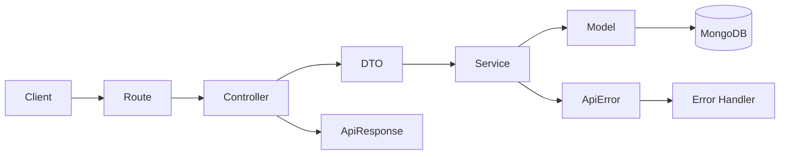

# Express Mongo Start

<p align="center">
  
</p>

<p align="center">
  A clean, beginner-friendly Express + MongoDB backend starter built to be understood, extended, and shipped.
</p>

<p align="center">
  <a href="https://github.com/real-VrajSoni/express-mongo-start"></a>
  <a href="https://github.com/real-VrajSoni/express-mongo-start/network/members"></a>
  
  
  
  
  <a href="LICENSE"></a>
</p>

<p align="center">
  <a href="#why-this-starter">Why this starter</a> ·
  <a href="#quick-start">Quick start</a> ·
  <a href="#project-structure">Structure</a> ·
  <a href="#api">API</a> ·
  <a href="#build-on-top-of-it">Build on top</a>
</p>

---

## Why this starter

Most backend tutorials become hard to maintain once the first few routes are working.

**Express Mongo Start** keeps the starting point deliberately small:

- **Feature-first folders** so related code stays together.
- **Shared utilities** for predictable API responses and errors.
- **MongoDB connection setup** already wired into server startup.
- **Auth scaffold** with routes, DTOs, controllers, services, model, and middleware separated by responsibility.
- **No fake functionality** — auth service methods explicitly return `501 Not Implemented` until you add the real logic.

> This is a **starter**, not a finished authentication system.

That distinction is intentional. You get the structure without inheriting a pile of unexplained code.

## Tech stack

| Tool | Purpose |
| --- | --- |
| **Node.js 22.12+** | Runtime |
| **Express 5** | HTTP server and routing |
| **MongoDB** | Database |
| **Mongoose 9** | MongoDB ODM |
| **dotenv** | Environment configuration |
| **CORS** | Cross-origin request handling |
| **ES Modules** | Native JavaScript module system |

## Quick start

### 1. Create your project

You can use this repository as a template:

**[Use this template](https://github.com/real-VrajSoni/express-mongo-start/generate)**

Or clone it:

```bash
git clone https://github.com/real-VrajSoni/express-mongo-start.git
cd express-mongo-start
npm install
```

### 2. Configure MongoDB

Copy the example environment file:

```bash
cp .env.example .env
```

Then set your values:

```env
PORT=3000
MONGODB_URI=mongodb://127.0.0.1:27017/my_project
```

Use a local MongoDB instance or replace the URI with your MongoDB Atlas connection string.

### 3. Start the server

Development:

```bash
npm run dev
```

Production-style start:

```bash
npm start
```

Then open:

**http://localhost:3000**

You should get:

```json
{
  "success": true,
  "message": "Welcome to your API!",
  "data": null
}
```

## Project structure

```text
express-mongo-start/
├── src/
│   ├── common/
│   │   ├── config/
│   │   │   └── db.js
│   │   ├── dto/
│   │   ├── middleware/
│   │   │   └── errorHandler.js
│   │   └── utils/
│   │       ├── ApiError.js
│   │       └── ApiResponse.js
│   │
│   ├── module/
│   │   └── auth/
│   │       ├── Dto/
│   │       │   ├── register.dto.js
│   │       │   ├── login.dto.js
│   │       │   ├── forgot-password.dto.js
│   │       │   ├── logout.dto.js
│   │       │   └── reset-password.dto.js
│   │       ├── controller.js
│   │       ├── middleware.js
│   │       ├── model.js
│   │       ├── routes.js
│   │       └── service.js
│   │
│   └── app.js
│
├── docs/
├── .env.example
├── server.js
├── package.json
└── LICENSE
```

### What each layer does

| Layer | Responsibility |
| --- | --- |
| `routes.js` | Maps HTTP endpoints to controllers |
| `controller.js` | Reads requests and sends responses |
| `Dto/` | Picks the input fields a feature needs |
| `service.js` | Holds the actual business logic |
| `model.js` | Defines MongoDB data through Mongoose |
| `middleware.js` | Home for auth-specific request checks |
| `common/` | Shared configuration, middleware, DTOs, and utilities |

The separation is intentionally simple:

**route → controller → DTO → service → model → database**

## How a request flows



For the current auth scaffold, the final database step is intentionally not implemented yet. The service throws a clear `501` error instead of pretending authentication works.


## API

### Welcome endpoint

| Method | Endpoint | Current result |
| --- | --- | --- |
| `GET` | `/` | Welcome response |

### Auth scaffold

| Method | Endpoint | Current result |
| --- | --- | --- |
| `POST` | `/api/auth/register` | `501 Not Implemented` |
| `POST` | `/api/auth/login` | `501 Not Implemented` |
| `POST` | `/api/auth/forgot-password` | `501 Not Implemented` |
| `POST` | `/api/auth/logout` | `501 Not Implemented` |
| `POST` | `/api/auth/reset-password` | `501 Not Implemented` |

Example:

```bash
curl -i -X POST http://localhost:3000/api/auth/register \
  -H 'Content-Type: application/json' \
  -d '{"name":"Alex","email":"alex@example.com","password":"example-password"}'
```

The response uses the shared response shape:

```json
{
  "success": false,
  "message": "Register is a starter placeholder. Add your code in service.js.",
  "data": null
}
```

## Consistent responses

The starter includes a tiny response helper in [`src/common/utils/ApiResponse.js`](src/common/utils/ApiResponse.js).

Example:

```js
return sendResponse(res, 200, 'Notes loaded', { notes });
```

Every response follows the same shape:

```json
{
  "success": true,
  "message": "Notes loaded",
  "data": {}
}
```

For errors, use [`src/common/utils/ApiError.js`](src/common/utils/ApiError.js):

```js
throw new ApiError(404, 'Note not found');
```

This keeps HTTP error handling in one place instead of repeating it throughout controllers.

## Build on top of it

A typical next step is to replace one placeholder service with your real application logic.

1. Create a new module under `src/module/`, such as `notes/`.
2. Add its routes, controller, service, model, and DTOs.
3. Mount the routes from `src/app.js`.
4. Add shared pieces to `src/common/` only when they are genuinely shared.

For the auth module, implement the service deliberately: validate input, hash passwords before storage, create your chosen session/token mechanism, and add the necessary authorization checks.

The existing `passwordHash` field is intended for a **hash**, never a plaintext password.

## What is intentionally not included

This repo does **not** claim to be a production-ready auth system.

It currently does not provide:

- password hashing
- token/session creation
- request validation
- authorization
- password-reset email delivery
- working auth persistence

Those are extension points for the project you build on top of the starter.

## Contributing

Improvements are welcome, especially changes that make the starter easier to understand without making it unnecessarily complicated.

See [`CONTRIBUTING.md`](CONTRIBUTING.md) for the contribution guidelines.

## License

Released under the [MIT License](LICENSE).

---

<p align="center">
  Built to be a starting point, not another framework-sized tutorial.
</p>

<p align="center">
  <a href="https://github.com/real-VrajSoni/express-mongo-start"><strong>⭐ Star the repo on GitHub</strong></a>
</p>
